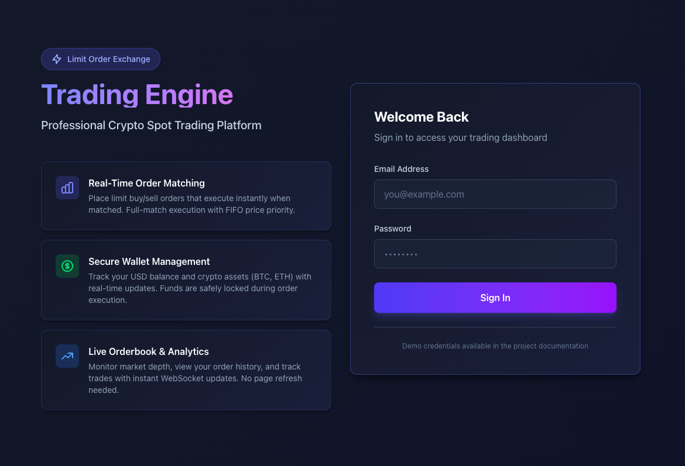
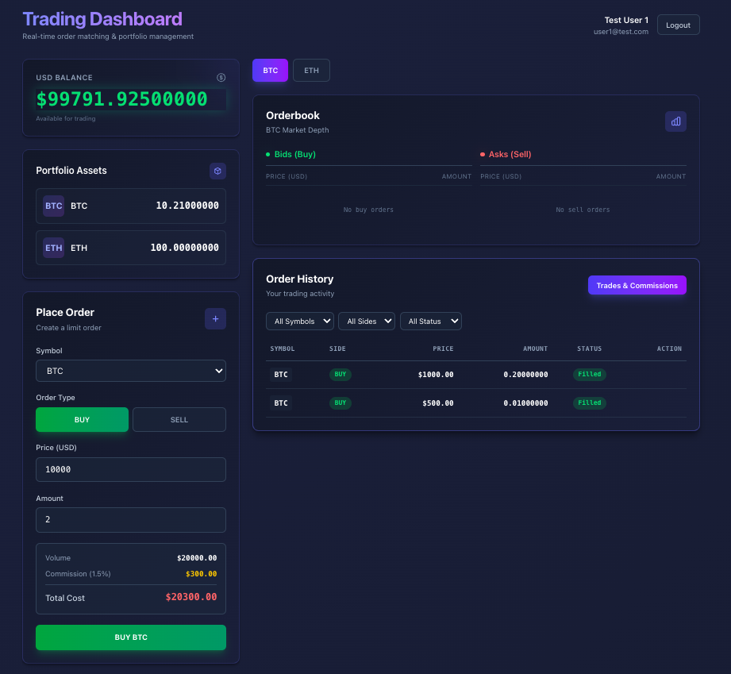
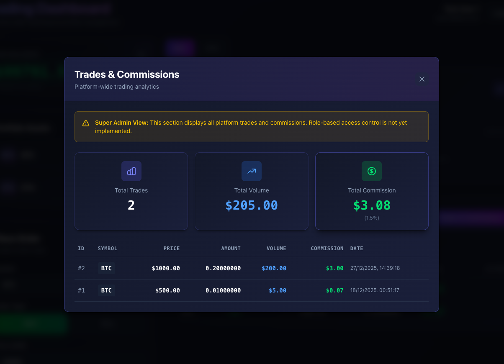

# 🚀 Full-Stack Trading Engine

**Laravel 12 API + Vue 3 + Real-Time Order Matching**

---

## 📌 Overview

This project is a **simplified crypto spot trading engine** built to demonstrate:

* Financial data integrity
* Concurrency-safe balance and asset management
* Deterministic limit-order matching
* Real-time updates using WebSockets
* Clean separation of backend and frontend concerns

The system supports **limit buy/sell orders**, **wallet balances**, **asset locking**, **full-match execution only**, and **instant UI updates** using **Laravel Broadcasting + Pusher**.

---

## 🛠 Technology Stack

### Backend

* **Laravel 12**
* **Laravel Sanctum** (token-based API authentication)
* **MySQL / PostgreSQL**
* **Laravel Broadcasting**
* **Pusher**

### Frontend

* **Vue 3** (Composition API)
* **Vite**
* **Tailwind CSS v4**
* **Axios**
* **Laravel Echo + Pusher JS**

---

## 🧱 Repository Structure

```
/
├── backend/        # Laravel 12 API
├── frontend/       # Vue 3 frontend
└── README.md
```

---

## 🔐 Authentication

* Token-based authentication using **Laravel Sanctum**
* Tokens are issued via `/api/login`
* Frontend sends token using:

  ```
  Authorization: Bearer <token>
  ```
* Same token is used for:

  * API access
  * Private broadcasting channel authorization

---

## 📊 Database Schema

### users

* Default Laravel fields
* `balance decimal(20,8)` — USD wallet balance

### assets

* `user_id`
* `symbol` (BTC, ETH)
* `amount decimal(20,8)` — available balance
* `locked_amount decimal(20,8)` — reserved for sell orders
* Unique constraint: `(user_id, symbol)`

### orders

* `user_id`
* `symbol`
* `side` (`buy` / `sell`)
* `price decimal(20,8)`
* `amount decimal(20,8)`
* `status`

  * `1 = OPEN`
  * `2 = FILLED`
  * `3 = CANCELLED`

### trades

* `buy_order_id`
* `sell_order_id`
* `symbol`
* `price`
* `amount`
* `usd_volume`
* `commission`
* All monetary fields use `decimal(20,8)`

---

## ⚙️ Core Business Rules

### Order Placement

* **BUY**

  * USD balance is checked and locked upfront
* **SELL**

  * Asset amount is moved to `locked_amount`
* All mutations happen inside **database transactions**
* Row-level locking (`SELECT FOR UPDATE`) prevents race conditions

### Order Cancellation

* Only OPEN orders can be cancelled
* Locked funds/assets are safely restored
* Fully transactional and race-safe

---

## 🔄 Matching Engine

* **Full match only** (no partial fills)
* FIFO with price priority
* Prevents self-matching
* Executed inside a single transaction
* Uses row-level locking on:

  * Orders
  * Users
  * Assets

### Commission

* **1.5% of USD trade volume**
* Charged to the **buyer**
* Seller receives full USD value

---

## 📡 Real-Time Updates

* On successful match, an `OrderMatched` event is broadcast
* Uses **private channels**:

  ```
  private-user.{id}
  ```
* Event payload includes:

  * Trade details
  * Updated balances
  * Updated assets
  * Order status updates
* Broadcast is dispatched **after DB commit** using `DB::afterCommit()`

---

## 🌐 API Endpoints

### Authentication

| Method | Endpoint      | Description                   |
| ------ | ------------- | ----------------------------- |
| POST   | `/api/login`  | Login and issue Sanctum token |
| POST   | `/api/logout` | Revoke current token          |

### Trading (Authenticated)

| Method | Endpoint                  | Description       |
| ------ | ------------------------- | ----------------- |
| GET    | `/api/profile`            | Wallet balances   |
| GET    | `/api/orders?symbol=BTC`  | Open orderbook    |
| POST   | `/api/orders`             | Place limit order |
| POST   | `/api/orders/{id}/cancel` | Cancel open order |

---

## 🎨 Frontend Features

### Pages

* **Login**
* **Dashboard**

### Dashboard Sections

* USD wallet balance
* Asset balances (available + locked)
* Live orderbook (buy / sell)
* Order history with status
* Cancel open orders
* Real-time updates without refresh

### Frontend Principles

* No balance computation on client
* No optimistic updates
* State updates only from backend responses or events

---

## 📸 Screenshots

### Login Page

The login page features a modern, trading-platform-style UI with a two-column layout. The left side provides an overview of platform features, while the right side contains the authentication form.



### Trading Dashboard

The main dashboard provides a comprehensive view of your trading activity, including:

* **Portfolio Overview**: USD balance and crypto asset holdings (BTC, ETH)
* **Order Placement**: Create limit buy/sell orders with real-time commission calculation
* **Live Orderbook**: Real-time market depth for selected trading pairs
* **Order History**: Complete order history with filtering and status tracking



### Trades & Commissions

The trades modal displays platform-wide trading analytics, including:

* **Summary Statistics**: Total trades, volume, and commissions
* **Trade History**: Detailed breakdown of all executed trades
* **Commission Tracking**: Real-time commission calculations (1.5% of trade volume)



---

## 🚀 Local Setup Instructions

### 📋 Prerequisites

* PHP ≥ 8.2
* Composer
* Node.js ≥ 18
* MySQL or PostgreSQL
* Pusher account (free tier works)

---

### 🧱 Backend Setup

```bash
cd backend
composer install
cp .env.example .env
php artisan key:generate
```

#### Configure `.env`

```env
DB_DATABASE=trading_engine
DB_USERNAME=root
DB_PASSWORD=

BROADCAST_DRIVER=pusher
PUSHER_APP_ID=xxxx
PUSHER_APP_KEY=xxxx
PUSHER_APP_SECRET=xxxx
PUSHER_APP_CLUSTER=ap2
```

```bash
php artisan migrate
php artisan db:seed
php artisan serve
```

Backend runs on:

```
http://127.0.0.1:8000
```

---

### 🎨 Frontend Setup

```bash
cd frontend
npm install
cp .env.example .env
```

```env
VITE_API_BASE_URL=http://127.0.0.1:8000
VITE_PUSHER_KEY=xxxx
VITE_PUSHER_CLUSTER=ap2
```

```bash
npm run dev
```

Frontend runs on:

```
http://localhost:5173
```

---

## 🔍 Demo Flow

1. Login as User A
2. Place BUY order
3. Login as User B
4. Place SELL order (same amount, valid price)
5. Observe:

   * Orders match instantly
   * Wallets update in real time
   * Order statuses change without refresh

---

## 🧠 Architecture Notes

* All financial operations are transactional
* Row-level locking ensures race safety
* Funds and assets are locked before matching
* Matching is deterministic and auditable
* Real-time events are dispatched after commit
* Frontend state is backend-driven

---

## 👤 Author

**Jaydeep Sureliya**

---

## 🧪 Automated Testing

The project includes comprehensive feature tests to validate critical trading functionality.

### What's Tested

| Test Suite | Coverage |
| ---------- | -------- |
| **AuthTest** | Login, logout, token validation, unauthorized access |
| **OrderPlacementTest** | Buy/sell order creation, balance/asset validation, input validation |
| **OrderCancellationTest** | Order cancellation, refund logic, authorization checks |
| **OrderMatchingTest** | Full-match execution, price crossing, commission calculation, self-match prevention |

### Testing Approach

* **Real database transactions** — No mocking of financial logic
* **Real models** — Uses actual Eloquent models and relationships
* **RefreshDatabase trait** — Clean state for each test
* **Sanctum authentication** — Tests use `actingAs()` for auth

### Running Tests

```bash
cd backend
php artisan test
```

Or run specific test files:

```bash
php artisan test --filter=AuthTest
php artisan test --filter=OrderMatchingTest
```

### Test Database Configuration

Tests use SQLite in-memory by default. Configure in `phpunit.xml`:

```xml
<env name="DB_CONNECTION" value="sqlite"/>
<env name="DB_DATABASE" value=":memory:"/>
```

---

## 🏁 Final Note

This project was intentionally designed with **correctness and safety over shortcuts**.
The implementation reflects **real-world trading system principles**, not demo-level assumptions.